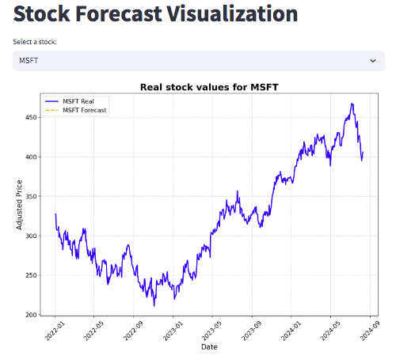

# Stock Price Forecasting with Prophet and Streamlit

## Overview

This project demonstrates the implementation of a stock price forecasting model using [Prophet](https://github.com/facebook/prophet) and its deployment via a [Streamlit](https://streamlit.io/) web application. The application provides users with the ability to visualize both historical and forecasted stock prices for major companies.

## Features

- **Data Collection**: Historical stock data is sourced from Yahoo Finance for companies including Microsoft (MSFT), Apple (AAPL), Amazon (AMZN), Google (GOOGL), and Meta (META).
- **Forecasting**: A forecasting model is developed for each stock using Prophet, offering predictions for the next 30 days.
- **Interactive Visualization**: The application allows users to select a stock and view both historical and forecasted prices, with visualizations that compare real and predicted values.
- **Deployment**: The final model and visualizations are deployed in an intuitive Streamlit application, making the insights easily accessible.

## Usage

1. **Data Preparation**: The script downloads historical stock data and prepares it for time series forecasting.
2. **Model Training**: Prophet models are trained on the historical data, and forecasts are generated.
3. **Visualization**: The Streamlit app provides an interface for users to explore the data and forecasts through interactive plots.
4. **Output**: The combined results, including historical data and forecasts, are saved to a CSV file for further analysis or visualization.
